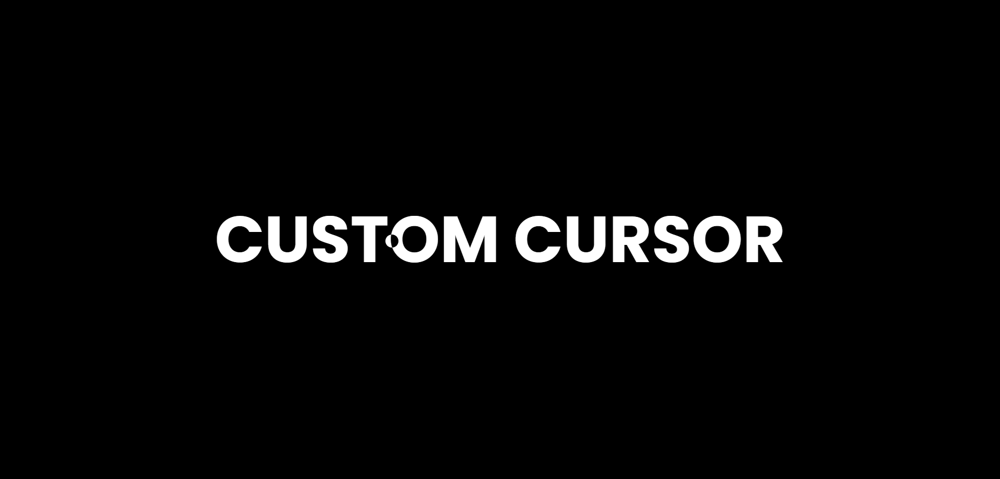

# Custom Cursor Follower
Hi, this repository features a Custom Cursor Follower web application built with HTML, CSS, and JavaScript. The app introduces a visual element that dynamically follows the default mouse cursor as it moves across the web page.

## [Live Preview](https://custom-cursor-follower-css-js.netlify.app/)

Built with:

  

## Output:

